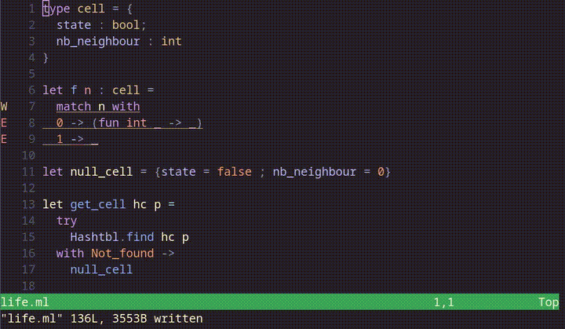
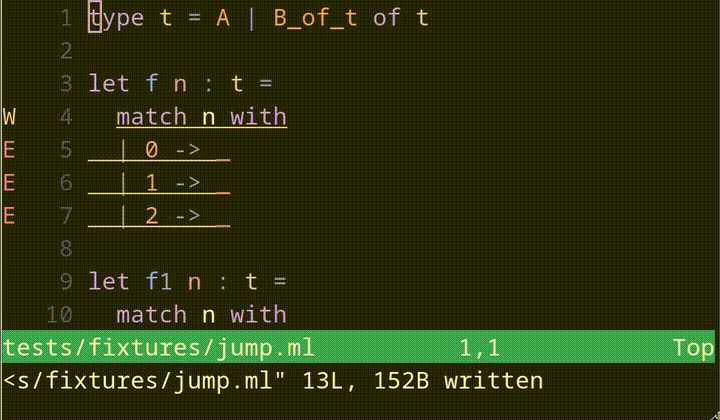
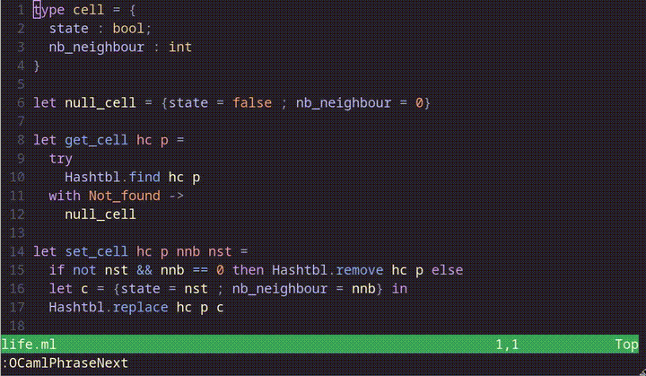
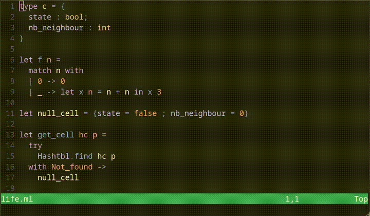
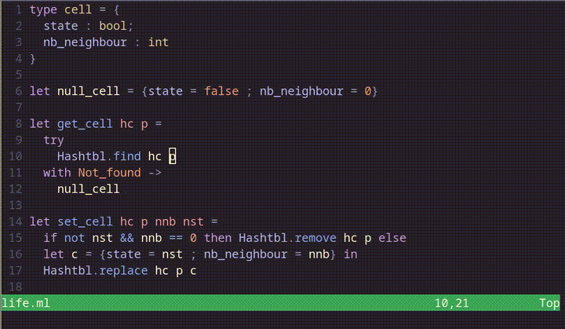
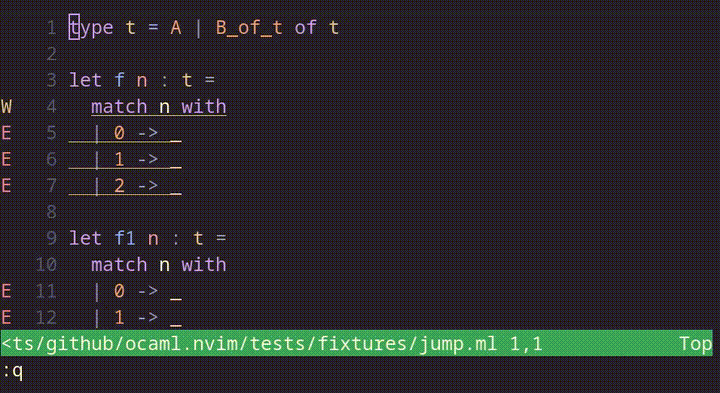
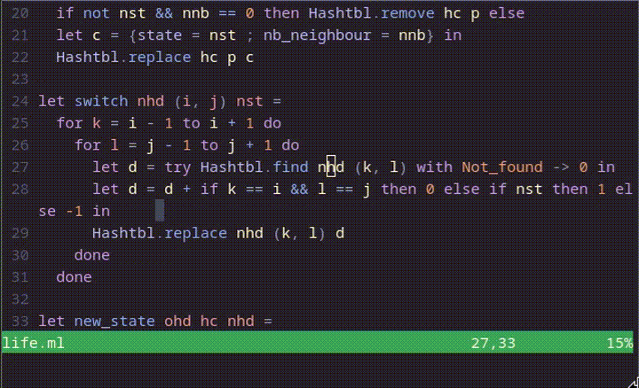

# ocaml.nvim

## What is ocaml.nvim?

`ocaml.nvim` is a Neovim plugin that enhances the OCaml development experience.
It is an extension of the Language Server Protocol (LSP) for OCaml, providing features beyond the standard LSP scope.
It aims to provide the features that [Merlin](https://ocaml.github.io/merlin/) offers, which are missing from LSP.
This plugin requires the OCaml LSP server `ocamllsp` to be installed to one of the directories in your `$PATH`.
It doesn't reimplement standard features of the LSP client, so you'll need a version of Neovim with a [built-in LSP
client](https://neovim.io/doc/user/lsp.html) and optionally the
[nvim-lspconfig](https://github.com/neovim/nvim-lspconfig) package configured
for `ocamllsp` (see
[here](https://github.com/neovim/nvim-lspconfig/blob/master/doc/configs.md#ocamllsp)
for instructions).
`ocaml.nvim` also simplifies the use of some code actions with dedicated commands.

## Table of contents

- [Getting Started](#getting-started)
- [Usage](#usage)
- [Customization](#customization)
- [Contributing](#contributing)

## Getting Started

This section guides you through setting up the essential components required to enable OCaml-specific editing features.
You will install the OCaml language server (`ocamllsp`), configure it natively or through Neovim's LSP client, and finally add the `ocaml.nvim` plugin to obtain the advanced features.

#### 1- Install [`ocamllsp`](https://github.com/ocaml/ocaml-lsp), the LSP server for OCaml

##### Using [Opam](https://github.com/ocaml/opam)

Opam allows you to install packages either locally (in the current switch) or globally (in all the existing switches).

```bash
$ opam install ocaml-lsp-server
```

##### From source

```bash
$ git clone --recurse-submodules http://github.com/ocaml/ocaml-lsp.git
$ cd ocaml-lsp
$ make install
```

Please read the dedicated [README.md](https://github.com/ocaml/ocaml-lsp) for more details.

#### 2- Add `ocamllsp` server in the LSP configuration

If you are using the native LSP please refer to the [official documentation](https://neovim.io/doc/user/lsp.html) for the installation.

If you are using a plugin giving you a set of LSP configuration like [`nvim-lspconfig`](https://github.com/neovim/nvim-lspconfig), please refer to its respective documentation.

#### 3- Add `ocaml.nvim` to your configuration

Using [lazy.nvim](https://github.com/folke/lazy.nvim)

```lua
require("lazy").setup({
  {"tarides/ocaml.nvim",
    config = function()
      require("ocaml").setup()
    end
  }
})
```

## Usage

This section lists all the functions available in Neovim to streamline your OCaml development workflow.
It covers both the functions provided by this plugin and those accessible via the OCaml LSP.
First, an overview table summarizes all available commands. Detailed explanations and examples are provided below, including links to the corresponding sections for more context.

### Commands Overview

| Command                                 | Keymap       | Action                                                     | Detail                                                   |
| --------------------------------------- | ------------ | ---------------------------------------------------------- | -------------------------------------------------------- |
| `:OCamlJumpPrevHole`                    | `<leader>p`  | Jump to the previous hole.                                 | [Holes handling](#holes-handling)                        |
| `:OCamlJumpNextHole`                    | `<leader>n`  | Jump to the next hole.                                     | [Holes handling](#holes-handling)                        |
| `:OCamlConstruct`                       | `<leader>c`  | Open a list of valid substitutions to fill the hole.       | [Holes handling](#holes-handling)                        |
| `:OCamlJump` expr?                      | `<leader>j`  | Open a list of jumpable expression or jump to `expr`.      | [Code navigation](#code-navigation)                      |
| `:OCamlPhraseNext`                      | `<leader>pn` | Jump to the beginning of the next phrase.                  | [Code navigation](#code-navigation)                      |
| `:OCamlPhrasePrev`                      | `<leader>pp` | Jump to the beginning of the previous phrase.              | [Code navigation](#code-navigation)                      |
| `:OCamlInferIntf`                       | `<leader>i`  | Infer the interface of the associated implementation file. | [Interface file management](#interface-file-management)  |
| `:OCamlSwitchIntfImpl`                  | `<leader>s`  | Switch between `.ml` file and `.mli` file.                 | [Interface file management](#interface-file-management)  |
| `:OCamlFindIdentifierDefinition` idt    |              | Open to the identifier `idt` definition.                   | [Identifier information](#identifier-information)        |
| `:OCamlFindIdentifierDeclaration` idt   |              | Open to the identifier `idt` declaration.                  | [Identifier information](#identifier-information)        |
| `:OCamlDocumentIdentifier` idt          |              | Display the identifier `idt` documentation.                | [Identifier information](#identifier-information)        |
| `:OCamlSearchDefinition` ty             |              | Open to the type `ty` definition.                          | [Type information](#type-information)                    |
| `:OCamlSearchDeclaration` ty            |              | Open to the type `ty` declaration.                         | [Type information](#type-information)                    |

### Details

#### Holes handling

Typed holes (`_`) are incomplete parts of your OCaml code where the compiler expects an expression.
- `:OCamlJumpPrevHole` jumps to the previous hole in the buffer.
- `:OCamlJumpNextHole` jumps to the next hole in the buffer.
- `:OCamlConstruct` opens a list of valid expressions that can replace the hole under the cursor, select the one you want and it will substitute the hole. Type inference is required to propose correct substitutions.



#### Code navigation

These functions help you navigate semantically in the buffer.
- `:OCamlJump expr` jumps to the parent expression referenced by `expr`. For example, this could be `:Jump let` to jump to the parent let of the current cursor location.



A phrase in OCaml is a complete syntactic unit, such as a definition, expression, or declaration, that can be evaluated or compiled independently.
- `:OCamlPhrasePrev` jumps to the beginning of the previous phrase in the code.
- `:OCamlPhraseNext` jumps to the beginning of the next phrase.



#### Interface file management

These functions help alternate between the `.ml` and `.mli` files and infer the interface.
- `:OCamlInferIntf` infers the type of an interface file from its implementation.
- `:OCamlSwitchIntfImpl` switches from the implementation file to the interface file and vice versa.



#### Identifier information

These functions provide information about a specific identifier specified by `idt`.
`idt` could be, for example, `List.hd` or `Sys.time`.
- `:OCamlFindIdentifierDefinition idt` opens the identifier `idt` definition in a split window.
- `:OCamlFindIdentifierDeclaration idt` opens the identifier `idt` declaration in a split window.
- `:OCamlDocumentIdentifier idt` shows the identifier `idt` documentation.



#### Type information

These functions enable you to search for values based on their type or polarity.
A polarity query prefixes the function arguments with `-` and the return with `+`.
For example, to search for a function of type `int -> string`, use `-int +string`.
Searching by polarity does not support type parameters.

A search by type (modulo isomorphisms) accepts a type expression close to what you would normally write in OCaml.
For instance, to find `int_of_string_opt`, you can search for `string -> int option`.
If multiple functions match the given type or polarity, a selection list appears.
After you choose one, the corresponding definition or declaration opens in a split window.

- `:OCamlSearchDefinition ty` lists all functions with type `ty` and opens the definition.
- `:OCamlSearchDeclaration ty` lists all functions with type `ty` and opens the declaration.



#### Type enclosing

These functions help you with the type of expression, either under the cursor or given as an argument.
You can adjust the size of the expression and the verbosity level of the type with the arrow keys.

- `:OCamlTypeEnclosing` starts a type enclosing session.
    - `<Up>` and `<Down>` grow and shrink the expression.
    - `<Right>` and `<Left>` increase and decrease the verbosity of the type observed.



- `:OCamlTypeExpression expr` prints the type of the expression `expr`. For example, it can be `[1;2;3]` which will return `int list`.


## Customization

You can customize all the keymaps available that doesn't have mandatory arguments.
To do that, you need to give the `setup` function the `keymaps` array.
Every keymap you provide should be a string and will overwrite the default one specified in the [Usage](#usage) table.
Below is the list of the available keymaps you can edit.

```lua
require("ocaml").setup({
  keymaps = {
    jump_next_hole = "<leader>n",
    jump_prev_hole = "<leader>p",
    construct = "<leader>c",
    jump = "<leader>j",
    phrase_prev = "<leader>pp",
    phrase_next = "<leader>pn",
    infer = "<leader>i",
    switch_ml_mli = "<leader>s",
    type_enclosing = "<leader>t",
    type_enclosing_grow = "<Up>",
    type_enclosing_shrink = "<Down>",
    type_enclosing_increase = "<Right>",
    type_enclosing_decrease = "<Left>",
  },
})
```

## Contributing

All contributions are welcome! Please read [CONTRIBUTING.md](./CONTRIBUTING.md)