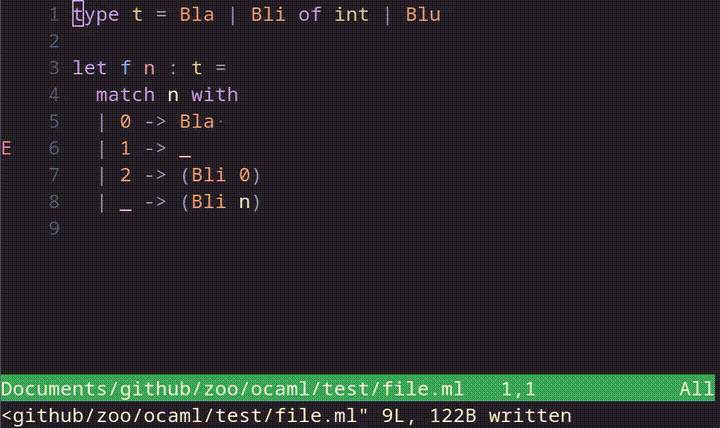
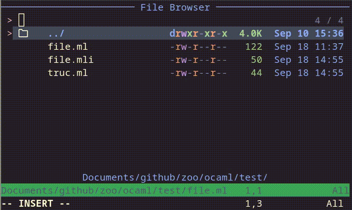
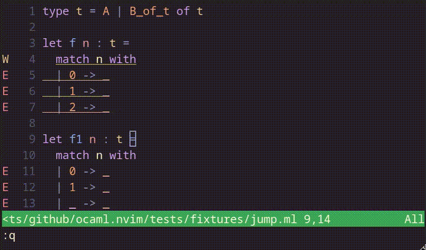

# ocaml.nvim

`ocaml.nvim` provides direct access to advanced `ocamllsp` features without
requiring complex editor-side logic.
`ocaml.nvim` aims to offer a fast, simple, and modular workflow in Neovim.
This plugin gives access to all the advanced Merlin commands not supported by
generic LSP clients, such as Construct, alternate between `.mli` and `.ml`
files, etc.

## Installation using `lazy.nvim`

Add the plugin to your `lazy.nvim` setup:

```lua
require("lazy").setup({
  { "tarides/ocaml.nvim",
    config = function()
      require("ocaml").setup()
    end
  }
})
```

## Features
Here is the list of commands offered by `ocaml.nvim` and their key binding.
All of the commands are detailed and illustrated in the following sections.

> [!IMPORTANT]
> This section only covers features specific to `ocaml.nvim`.
> However, the builtin LSP of Neovim already provides standards commands such as
> go-to-definition and hover documentation.

| Command | Default Binding | Available | Tests | Description |
| -- | -- | -- | -- | -- |
| `OCamlJumpPrevHole` | -- | :white_check_mark: | :white_check_mark: | Jump to the previous hole. |
| `OCamlJumpNextHole` | -- | :white_check_mark: | :white_check_mark: | Jump to the next hole. |
| `OCamlConstruct` | -- | :white_check_mark: | :white_check_mark: | Open up a list of valid substitutions to fill the hole. |
| `OCamlJump` | -- | :white_check_mark: | :x: | Jumps to the referenced expression. |
| `OCamlPhraseNext` | -- | :white_check_mark: | :x: | Jump to the beginnning of the previous phrase. |
| `OCamlPhrasePrev` | -- | :white_check_mark: | :x: | Jump to the beginning of the next phrase. |
| `OCamlInferIntf` | -- | :white_check_mark: | :x: | Infer the interface for the current implementation file. |
| `OCamlAlternateFile` | -- | :white_check_mark: | :x: | Switch from the implementation file to the interface file and vice versa. |
| `OCamlFindIdentifierDefinition` | -- | :white_check_mark: | :x: | -- |
| `OCamlFindIdentifierDeclaration` | -- | :white_check_mark: | :x: | -- |
| `OCamlDocumentIdentifier` | -- | :white_check_mark: | :x: | Enables you to enter an identifier (present in the environment) and return its documentation. |
| `OCamlErrorNext` | -- | :x: | :x: | Jump to the next error. |
| `OCamlErrorPrev` | -- | :x: | :x: | Jump to the previous error. |
| `OCamlFindDefinition` | -- | :x: | :x: | Jump to definition (the implementation). |
| `OCamlFindDefinitionInNewWindow` | -- | :x: | :x: | -- |
| `OCamlFindDefinitionInCurrentWindow` | -- | :x: | :x: | -- |
| `OCamlFindDeclaration` | -- | :x: | :x: | Jump to declaration (the signature). |
| `OCamlFindDeclarationInNewWindow` | -- | :x: | :x: | -- |
| `OCamlFindDefinitionInCurrentWindow` | -- | :x: | :x: | -- |
| `OCamlFindTypeDefinition` | -- | :x: | :x: | Jump to the type definition of the expression. |
| `OCamlFindTypeDefinitionInNewWindow` | -- | :x: | :x: | -- |
| `OCamlFindTypeDefinitionInCurrentWindow` | -- | :x: | :x: | -- |
| `OCamlSearch` | -- | :x: | :x: | Searches for a value by its type or polarity to included in the current buffer. |
| `OCamlSearchDefinition` | -- | :x: | :x: | Searches for a value definition by its type or polarity. |
| `OCamlSearchDefinitionInNewWindow` | -- | :x: | :x: | -- |
| `OCamlSearchDefinitionInCurrentWindow` | -- | :x: | :x: | -- |
| `OCamlSearchDeclaration` | -- | :x: | :x: | Searches for a value declaration by its type or polarity. |
| `OCamlSearchDeclarationInNewWindow` | -- | :x: | :x: | -- |
| `OCamlSearchDeclarationInCurrentWindow` | -- | :x: | :x: | -- |
| `OCamlDocument` | -- | :x: | :x: | Documents the expression below the cursor. |
| `OCamlDestruct` | -- | :x: | :x: | Allows you to generate and manipulate pattern matching expressions. |
| `OCamlTypeExpression` | -- | :x: | :x: | -- |
| `OCamlTypeEnclosing` | -- | :x: | :x: | Display the type of the selection and start a "type enclosing" session. |
| `OCamlOccurences` | -- | :x: | :x: | Returns all occurrences of the identifier under the cursor. |
| `OCamlRename` | -- | :x: | :x: | Rename the symbol under the cursor. |

### Construct expression

Enables you to navigate between typed-holes (`_`) in a document and
interactively substitute them:

- `OCamlJumpPrevHole`: jump to the next hole
- `OCamlJumpNextHole`: jump to the previous hole
- `OCamlConstruct`: open up a list of valid substitutions to fill the hole


### Source browsing

Allows you to navigate semantically in a buffer, passing from an expression to
the parent `let`, the parent `module`, the parent `fun` and the parent `match` expression.
It is also possible to navigate between pattern matching cases:

- `OCamlJump`: jumps to the referenced expression


- `OCamlPhrasePrev`: jump to the beginning of the previous phrase
- `OCamlPhraseNext`: jump to the beginning of the next phrase


### Infer interface

Used to infer the type of an interface file. If the buffer is not empty,
a prompt will ask for confirmation to overwrite the buffer contents.



### Find alternate file

Quickly switch from the implementation file to the interface file and
vice versa. If the interface file does not exist, a prompt can be used to
generate it.



### Find identifiers definition/declaration

It is possible to directly enter the name of an identifier (definition or declaration) using the following commands.

- `OCamlFindIdentifierDefinition`
- `OCamlFindIdentifierDeclaration`



### Get documentation

It is possible to get the document of the identifier given in the argument.

- `OCamlDocumentIdentifier`


### Search declaration/definition

- `SearchDeclaration` searches for a value by its type or polarity and jump to its declaration
- `SearchDefinition` searches for a value by its type or polarity and jump to its definition


