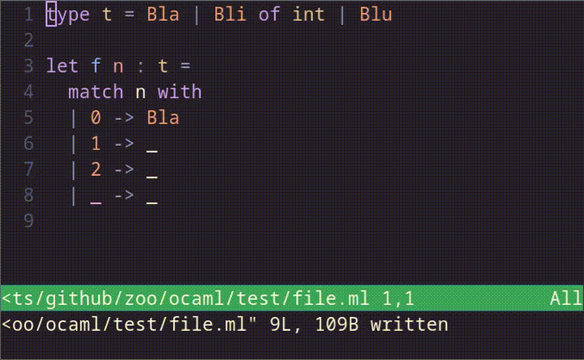
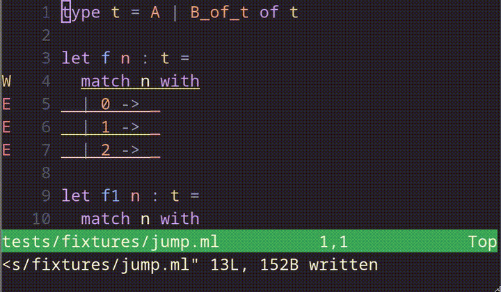
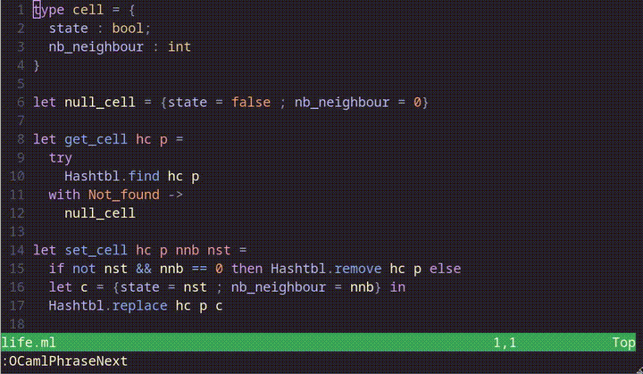
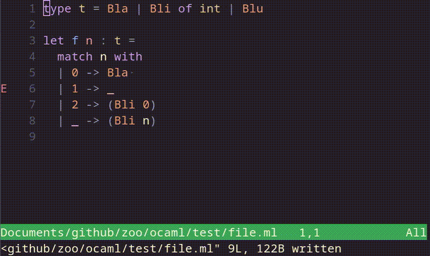
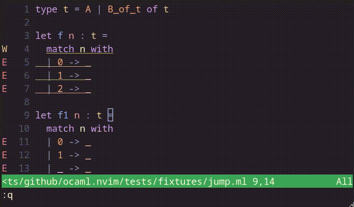
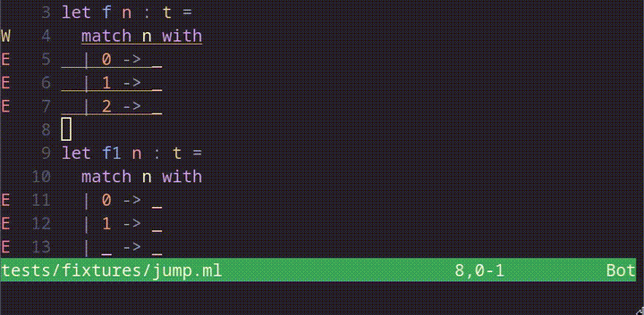

# ocaml.nvim

## What is ocaml.nvim?
`ocaml.nvim` is a Neovim plugin that enhances the OCaml development experience.
It should be used in addition to the LSP plugin of Neovim, `lsp-config,` and especially the OCaml server, `ocamllsp.`
`ocamllsp` relies on Merlin's editions' features that go beyond the standard of LSP.
Th# ocaml.nvim

## What is ocaml.nvim?
`ocaml.nvim` is a Neovim plugin that enhances the OCaml development experience.
It should be used in addition to the LSP plugin of Neovim, `lsp-config,` and especially the OCaml server, `ocamllsp.`
`ocamllsp` relies on Merlin's editions' features that go beyond the standard of LSP.
This is why this plugin adds advanced features to provide Neovim users with the best user experience of OCaml.
More than adding new features encoded with custom requests, it also simplifies the use of some code actions with a specific keybind.

## Table of contents
- [Getting Started](#getting-started)
- [Usage](#usage)
- [Customization](#customization)
- [Contributing](#contributing)

## Getting Started
This section guides you through setting up the essential components required to enable OCaml-specific editing features.
You will install the OCaml language server (`ocamllsp`), configure it through Neovim's LSP client (`nvim-lspconfig`), and finally add the `ocaml.nvim` plugin to obtain the advanced features.

#### LSP server for OCaml, [`ocamllsp`](https://github.com/ocaml/ocaml-lsp)
Using [Opam](https://github.com/ocaml/opam)
```bash
$ opam install ocaml-lsp-server
```

From source
```bash
$ git clone --recurse-submodules http://github.com/ocaml/ocaml-lsp.git
$ cd ocaml-lsp
$ make install
```

Please read the dedicated [README.md](https://github.com/ocaml/ocaml-lsp) for more details.

#### [`lsp-config`](https://github.com/neovim/nvim-lspconfig) for OCaml
Using [vim-plug](https://github.com/junegunn/vim-plug)
```viml
Plug 'neovim/nvim-lspconfig'
```

Then in your `init.lua`,
```lua
require("lspconfig").ocamllsp.setup {}
```

Using [packer.nvim](https://github.com/wbthomason/packer.nvim)
```lua
use {
  "neovim/nvim-lspconfig",
  config = function()
    local lspconfig = require("lspconfig")
    lspconfig.ocamllsp.setup {}
  end,
}
```

Using [lazy.nvim](https://github.com/folke/lazy.nvim)
```lua
require("lazy").setup({
  {"neovim/nvim-lspconfig",
    event = {"BufReadPre", "BufNewFile"},
    config = function()
      local lspconfig = require("lspconfig")
      -- OCaml LSP setup
      lspconfig.ocamllsp.setup {}
    end,
  }
```

Please read the dedicated [README.md](https://github.com/neovim/nvim-lspconfig) for more details.

#### `ocaml.nvim`
Using [vim-plug](https://github.com/junegunn/vim-plug)

```viml
Plug 'tarides/ocaml.nvim'
```

Using [packer.nvim](https://github.com/wbthomason/packer.nvim)

```lua
use {
  "tarides/ocaml.nvim",
  config = function()
    require("ocaml").setup()
  end
}
```

Using [lazy.nvim](https://github.com/folke/lazy.nvim)

```lua
require("lazy").setup({
  {"tarides/ocaml.nvim",
    config = function()
      require("ocaml").setup()
    end
  }
})
```

## Usage
This section lists all the functions available in Neovim to streamline your OCaml development workflow.
It covers both the functions provided by this plugin and those accessible via the OCaml LSP when used with `lsp-config`.
First, an overview table summarizes all available commands. Detailed explanations and examples are provided below, including links to the corresponding sections for more context.

### Commands Overview
| Command                            | Action                                                     | Detail                                                   | Plugin     |
| ---------------------------------- | ---------------------------------------------------------- | -------------------------------------------------------- | ---------- |
| `:JumpPrevHole`                    | Jump to the previous hole.                                 | [Holes handling](#holes-handling)                        | ocaml.nvim |
| `:JumpNextHole`                    | Jump to the next hole.                                     | [Holes handling](#holes-handling)                        | ocaml.nvim |
| `:Construct`                       | Open a list of valid substitutions to fill the hole.       | [Holes handling](#holes-handling)                        | ocaml.nvim |
| `:Jump` arg                        | Jump to the referenced expression by `arg`.                | [Code navigation](#code-navigation)                      | ocaml.nvim |
| `:PhraseNext`                      | Jump to the beginning of the next phrase.                  | [Code navigation](#code-navigation)                      | ocaml.nvim |
| `:PhrasePrev`                      | Jump to the beginning of the previous phrase.              | [Code navigation](#code-navigation)                      | ocaml.nvim |
| `:InferIntf`                       | Infer the interface of the associated implementation file. | [Interface file management](#interface-file-management)  | ocaml.nvim |
| `:AlternateFile`                   | Alternate between `.ml` and `.mli`.                        | [Interface file management](#interface-file-management)  | ocaml.nvim |
| `:FindIdentifierDefinition` arg    | Open the definition of the identifier `arg`.               | [Identifier information](#identifier-information)        | ocaml.nvim |
| `:FindIdentifierDeclaration` arg   | Open to the identifier `arg` declaration.                  | [Identifier information](#identifier-information)        | ocaml.nvim |
| `:DocumentIdentifier` arg          | Display the identifier `arg` documentation.                | [Identifier information](#identifier-information)        | ocaml.nvim |

### Details

#### Holes handling
Typed holes (`_`) are incomplete parts of your OCaml code where the compiler expects an expression.
- `:JumpPrevHole` jumps to the previous hole in the buffer.
- `:JumpNextHole` jumps to the next hole in the buffer.
- `:Construct` opens a list of valid expressions that can replace the hole under the cursor. Type inference is required to propose correct substitutions.



#### Code navigation
These functions help you navigate semantically in the buffer.
- `:Jump arg` jumps to the expression or declaration referenced by `arg`. For example, this could be `:Jump let` to jump to the



A phrase in OCaml is a complete syntactic unit, such as a definition, expression, or declaration, that can be evaluated or compiled independently.
- `:PhrasePrev` jumps to the beginning of the previous phrase in the code.
- `:PhraseNext` jumps to the beginning of the next phrase.



#### Interface file management
These functions help alternate between the `.ml` and `.mli` files and infer the interface.
- `:InferIntf` infer the type of an interface file from its implementation.



- `:AlternateFile` switch from the implementation file to the interface file and vice versa.

#### Identifier information
These functions provide information about a specific identifier specified by `arg`.
`arg` could be, for example, `List.hd` or `Sys.time`.
- `:FindIdentifierDefinition arg` opens the identifier `arg` definition.
- `:FindIdentifierDeclaration arg` opens the identifier `arg` declaration.



- `:DocumentIdentifier arg` shows the identifier `arg` documentation.



## Customization
:construction_worker: ToDo

## Contributing

All contributions are welcome! Just open a pull request.
Please read [CONTRIBUTING.md](./CONTRIBUTING.md)

