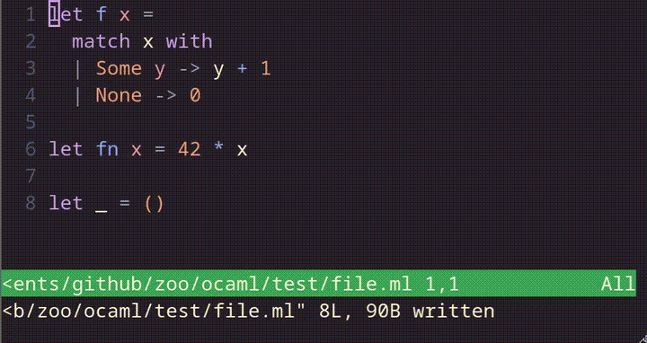

# ocaml.nvim

`ocaml.nvim` provides direct access to advanced `ocamllsp` features without
requiring complex editor-side logic.
`ocaml.nvim` aims to offer a fast, simple, and modular workflow in Neovim.
This plugin gives access to all the advanced Merlin commands not supported by
generic LSP clients, such as Construct, alternate between `.mli` and `.ml`
files, etc.

## Installation using `lazy.nvim`
Add the plugin to your `lazy.nvim` setup:

```lua
require("lazy").setup({
  { "tarides/ocaml.nvim",
    lazy = false,
    config = function()
      require("ocaml")
    end
  }
})
```

## Features
Here is the list of commands offered by `ocaml.nvim` and their key binding.
All of the commands are detailed and illustrated in the following sections.

> [!IMPORTANT]
> This section only covers features specific to `ocaml.nvim`.
> However, the builtin LSP of Neovim already provides standards commands such as
> go-to-definition and hover documentation.

| Command | Default Binding | Available | Tests | Description |
| -- | -- | -- | -- | -- |
| `JumpPrevHole` | -- | :white_check_mark: | :white_check_mark: | Jump to the previous hole. |
| `JumpNextHole` | -- | :white_check_mark: | :white_check_mark: | Jump to the next hole. |
| `Construct` | -- | :white_check_mark: | :white_check_mark: | Open up a list of valid substitutions to fill the hole. |
| `Jump` | -- | :white_check_mark: | :x: | Jumps to the referenced expression. |
| `PhraseNext` | -- | :white_check_mark: | :x: | Jump to the beginnning of the previous phrase. |
| `PhrasePrev` | -- | :white_check_mark: | :x: | Jump to the beginning of the next phrase. |
| `ErrorNext` | -- | :x: | :x: | Jump to the next error. |
| `ErrorPrev` | -- | :x: | :x: | Jump to the previous error. |
| `FindDefinition` | -- | :x: | :x: | Jump to definition (the implementation). |
| `FindDefinitionInNewWindow` | -- | :x: | :x: | -- |
| `FindDefinitionInCurrentWindow` | -- | :x: | :x: | -- |
| `FindIdentifierDefinition` | -- | :x: | :x: | -- |
| `FindIdentifierDefinitionInNewWindow` | -- | :x: | :x: | -- |
| `FindIdentifierDefinitionInCurrentWindow` | -- | :x: | :x: | -- |
| `FindDeclaration` | -- | :x: | :x: | Jump to declaration (the signature). |
| `FindDeclarationInNewWindow` | -- | :x: | :x: | -- |
| `FindDefinitionInCurrentWindow` | -- | :x: | :x: | -- |
| `FindIdentifierDeclaration` | -- | :x: | :x: | -- |
| `FindIdentifierDeclarationInNewWindow` | -- | :x: | :x: | -- |
| `FindIdentifierDeclarationInCurrentWindow` | -- | :x: | :x: | -- |
| `FindTypeDefinition` | -- | :x: | :x: | Jump to the type definition of the expression. |
| `FindTypeDefinitionInNewWindow` | -- | :x: | :x: | -- |
| `FindTypeDefinitionInCurrentWindow` | -- | :x: | :x: | -- |
| `InferInterface` | -- | :x: | :x: | Infer the interface for the current implementation file. |
| `AlternateFile` | -- | :x: | :x: | Switch from the implementation file to the interface file and vice versa. |
| `Search` | -- | :x: | :x: | Searches for a value by its type or polarity to included in the current buffer. |
| `SearchDefinition` | -- | :x: | :x: | Searches for a value definition by its type or polarity. |
| `SearchDefinitionInNewWindow` | -- | :x: | :x: | -- |
| `SearchDefinitionInCurrentWindow` | -- | :x: | :x: | -- |
| `SearchDeclaration` | -- | :x: | :x: | Searches for a value declaration by its type or polarity. |
| `SearchDeclarationInNewWindow` | -- | :x: | :x: | -- |
| `SearchDeclarationInCurrentWindow` | -- | :x: | :x: | -- |
| `Document` | -- | :x: | :x: | Documents the expression below the cursor. |
| `DocumentIdentifier` | -- | :x: | :x: | Enables you to enter an identifier (present in the environment) and return its documentation. |
| `Destruct` | -- | :x: | :x: | Allows you to generate and manipulate pattern matching expressions. |
| `TypeExpression` | -- | :x: | :x: | -- |
| `TypeEnclosing` | -- | :x: | :x: | Display the type of the selection and start a "type enclosing" session. |
| `Occurences` | -- | :x: | :x: | Returns all occurrences of the identifier under the cursor. |
| `Rename` | -- | :x: | :x: | Rename the symbol under the cursor. |

### Construct expression

Enables you to navigate between typed-holes (`_`) in a document and
interactively substitute them:

- `JumpPrevHole`: jump to the next hole
- `JumpNextHole`: jump to the previous hole
- `Construct`: open up a list of valid substitutions to fill the hole


### Source browsing

Allows you to navigate semantically in a buffer, passing from an expression to
the parent `let`, the parent `module`, the parent `fun` and the parent `match` expression.
It is also possible to navigate between pattern matching cases:

- `Jump`: jumps to the referenced expression


- `PhrasePrev`: jump to the beginning of the previous phrase
- `PhraseNext`: jump to the beginning of the next phrase

